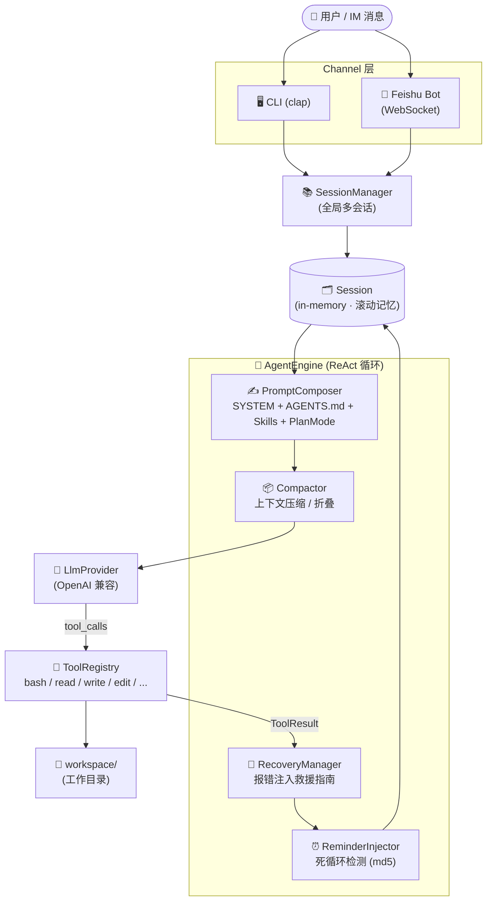

# rs-tiny-claw 🦀

> 一个基于「驾驭工程 (Harness Engineering)」理念、使用 **Rust** 从零实现的微型 AI Agent 操作系统。
> 参考极客时间专栏《从零构建 Agent Harness》的实战产出 `go-tiny-claw`，本项目使用 Rust 重写并扩展。

---

## 🧭 架构总览



## 🗂 目录结构

```
src/
├── main.rs                 # CLI 入口 (clap 解析)
├── lib.rs                  # 模块汇总
├── error.rs                # AppError / Result
│
├── schema/                 # 消息 / 工具调用 / 工具描述的统一数据模型
│
├── provider/               # LLM Provider (OpenAI 兼容 Chat Completions)
│   └── openai.rs
│
├── tools/                  # 内置工具集
│   ├── bash.rs             #   - bash (30s 超时)
│   ├── read_file.rs        #   - read_file (UTF-8 安全截断)
│   ├── write_file.rs       #   - write_file (自动 mkdir)
│   └── edit_file.rs        #   - edit_file (模糊匹配：换行归一 + 行级 trim)
│
├── context/                # 上下文工程
│   ├── composer.rs         #   - PromptComposer (system + AGENTS.md + skills)
│   ├── compactor.rs        #   - Compactor (字符预算，保留 working memory)
│   ├── recovery.rs         #   - RecoveryManager (按工具名分类的报错建议)
│   └── skill.rs            #   - SkillLoader (.claw/skills/SKILL.md)
│
├── engine/                 # Agent 内核
│   ├── loop.rs             #   - AgentEngine.run() ReAct 主循环
│   ├── session.rs          #   - Session + 全局 SessionManager
│   ├── reminder.rs         #   - ReminderInjector (md5 指纹, 阈值 3)
│   ├── reporter.rs         #   - Reporter trait
│   └── terminal_reporter.rs#   - 终端输出实现
│
└── channel/                # 外部通道
    └── feishu_bot.rs       #   - 飞书 WebSocket + FeishuReporter
```

## 🔥 核心特性

### 1. 双阶段 ReAct 循环（可选 Thinking）

[AgentEngine::run](src/engine/loop.rs) 先在 _无工具_ 状态下做一次「慢思考」，再挂载工具链发起行动。两者输出合并后写入 Session，最大限度保留模型可解释性。

### 2. 上下文工程（Context Engineering）

- **[PromptComposer](src/context/composer.rs)** 自动组装 System Prompt：
  1. 内置 `SYSTEM_PROMPT` 核心纪律
  2. `<work_dir>/AGENTS.md` 项目专属指南
  3. `Plan Mode` 模板（强制 `PLAN.md` / `TODO.md` 外部化）
  4. `<work_dir>/.claw/skills/**/SKILL.md` 解析 frontmatter 后注入
- **[Compactor](src/context/compactor.rs)** 在每次循环检测字符预算：
  - 早期 `tool` 消息：折叠为占位说明
  - 早期 `assistant` 思考：折叠为占位说明
  - 近期 working memory (后 N 条)：保留 `head + tail` 中间截断
  - `System` 消息永久保留
- **[RecoveryManager](src/context/recovery.rs)** 按工具名匹配错误模式，注入**可执行的救援指南**（"先 read_file 再 edit_file"、"将服务转入后台" 等），而不是把裸 stderr 丢回给 LLM。
- **[ReminderInjector](src/engine/reminder.rs)** 用 `MD5(tool_name + args)` 给工具调用打指纹，连续 3 次以上相同指纹失败 → 注入强干预消息，强制模型跳出局部思维。

### 3. 多会话隔离

[SessionManager](src/engine/session.rs) 以 `id` 维度维护 `Arc<Session>`，每个 Session 拥有：

- 独立历史 (`RwLock<Vec<Message>>`)
- 独立 `work_dir`
- `get_working_memory(limit)` 提供滚动窗口

适合 CLI 多任务、IM 多用户并发场景。

### 4. 工具集（File System + Bash）

| 工具         | 说明                                                               |
| ------------ | ------------------------------------------------------------------ |
| `bash`       | 在 `work_dir` 内执行任意命令，30s 硬超时，常驻服务需 `nohup ... &` |
| `read_file`  | 读取相对工作区路径                                                 |
| `write_file` | 创建或覆盖写入，自动 `mkdir -p` 父目录                             |
| `edit_file`  | 局部字符串替换，三段式模糊匹配（精确 → 换行归一 → 行级 trim）      |

### 5. 飞书 (Lark) Channel

[feishu_bot.rs](src/channel/feishu_bot.rs) 通过 WebSocket 长连接接收消息，回包走 `im.v1.messages` REST API。每个 `chat_id` 自动映射到一个独立 Session。

### 6. Plan Mode（任务外部化）

开启 `plan_mode=true` 后：

1. 启动时强制检查 `PLAN.md` / `TODO.md`
2. 不存在则新建；存在则进入「断点续传」流程
3. 每次子任务完成**必须**用 `edit_file` 立刻把对应 `- [ ]` 改为 `- [x]`，杜绝「一口气写完最后打勾」

## 🚀 快速开始

### 1. 准备环境

```bash
# 任意 OpenAI 兼容的 Chat Completion 服务
export OPENAI_BASE_URL="https://api.openai.com/v1"
export LLM_API_KEY="sk-xxxx"
export LLM_MODEL="gpt-4o-mini"
```

> 参考 [env.example](env.example)。

### 2. 启动 CLI 单次任务

```bash
cargo run -- --prompt "在 workspace 目录下新建一个 hello.txt，内容是 Hello Harness!"
```

- 工作区默认取 `./workspace/`，所有工具路径相对该目录解析。
- 模型所有回复、工具调用、报错会以彩色 emoji 形式输出到终端。

### 3. 启动飞书机器人（可选）

```bash
export FEISHU_APP_ID="cli_xxx"
export FEISHU_APP_SECRET="xxx"
export FEISHU_BASE_URL="https://open.feishu.cn"
# 取消 main.rs 中 feishu_bot_start 行的注释后
cargo run -- --prompt "noop"  # 提示词可任意
```

### 4. 加载项目级上下文（推荐）

在工作区根目录放置 `AGENTS.md` 描述项目规范；放置 `.claw/skills/<name>/SKILL.md`：

```markdown
---
name: commit-message
description: 当用户要求提交代码时使用
---

# 提交规范

- 标题不超过 50 字，使用动词开头
- body 说明动机与对比
```

`SkillLoader` 会自动扫描并注入到 system prompt。

## 📜 License

[MIT](LICENSE) © 2026 rs-tiny-claw contributors
